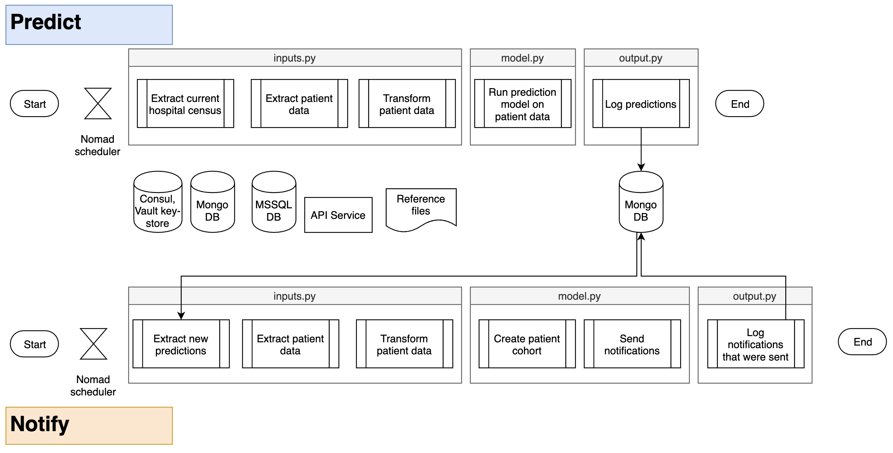
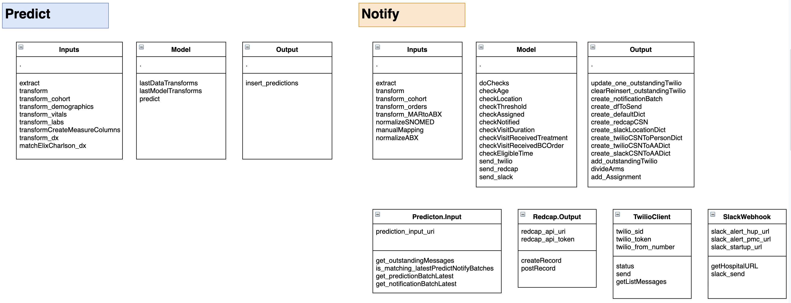
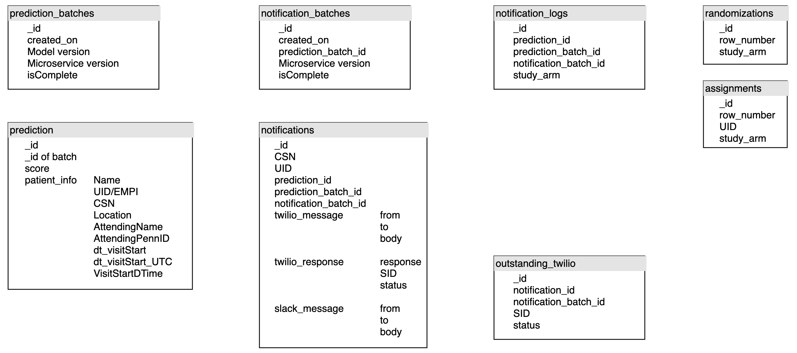

# Rapid IDentification of Sepsis
A framework for scheduling predictions and notifications in real time

**Use case:**

At the hospitals in our pilot study, we want to identify patients at high risk of sepsis in the emergency department (ED) with a real-time predictive model. Patients identified as high risk are randomized to one of two groups:
1) Active alert: The clinician is informed that their patient has a high risk for sepsis and a blood culture order should be ordered
2) Silent control: The clinician is not alerted and proceeds with the usual standard of care.

The fast pace of the emergency department combined with the limited amount of accumulated patient data makes operationalizing prediction models in this setting particularly challenging. Real-time data collection as well as timely processing and alerting is essential to improving meaningful outcomes.

**Implementation:**

Our framework consists of two microservices that run on batches of data
1) The Predict piece makes predictions on the cohort of interest
2) The Notify piece sends alerts based on the predictions

Modularizing these services allows us to control these components independently, extracting and processing the minimal amount of data required.

## Predict
The scheduler runs the Predict job every 15 minutes.

*inputs.py*

The inputs and transforms include:
- The current patient lists from the hospitals in the study (MongoDB)
- The patient data required for the prediction model (MongoDB, MSSQL DB)
- Mapping demographic information, vitals, and labs to their common names (See reference files)
- Mapping diagnoses to Elixhauser and Charlson comorbidities (See reference files)

*model.py*

The model script does the following:
- Loads the existing prediction model
- One-hot encodes categorical features
- Runs predictions on all the patients in the list

*output.py*
- Stores all the predictions as a batch (MongoDB, see Domain Model)

## Notify

The scheduler runs the Notify job at double the timing of the Predict job (i.e. every 8 minutes)

*inputs.py*

The first input is the latest batch of predictions to make sure it hasn’t already been processed. 
If the batch has not been processed, the job pulls additional specific inputs necessary to filter the candidate cohort:
- Medications from the Medication Administration Record (MAR)
    - The medications are mapped to antibiotic categories and normalized. (See reference files)
- Blood cultures

*model.py*

Transforming the data involves further narrowing down the candidate cohort by applying a series of filters (e.g. Age, Predicted risk above a defined threshold, Has not already received an alert). 

If the patient is deemed eligible for the candidate cohort, the job does the following:
- Writes the patient information as a new study participant in REDCap.
- Sends a message over Slack.
- Sends a text message over Twilio.
- Stores any notifications that are sent out

*output.py*
- Stores the full predicted batch with its notification filters

## Caveats in current implementation
- Randomization was built but turned off (commented out)
- Twilio was built and set up but turned off (commented out)
- The “now” timestamp parameter is used to “rewind” and run scenarios as if in the past. It is built but has not been fully tested.

## Reference files
**SNOMED-related files**
- local/brands_and_generic.csv
    - Brand names mapped to SNOMED concept IDs of generic drugs
- local/snomedid_description.txt
    - Relevant antibiotics
- local/snomedid_description_norm_map.txt
    - Explicit mappings

**Comorbidity-related files**
- Format of files:
    - Comorbidity	ICD9_REGEX	ICD10_REGEX	Points
- \[Insert Quan et al reference\]
- local/charlson_map.tsv
- local/elixhauser_map.tsv

**System-specific mappings of vitals and labs**
- local/vitals_map.tsv
- local/orders_map.tsv

## Domain model

